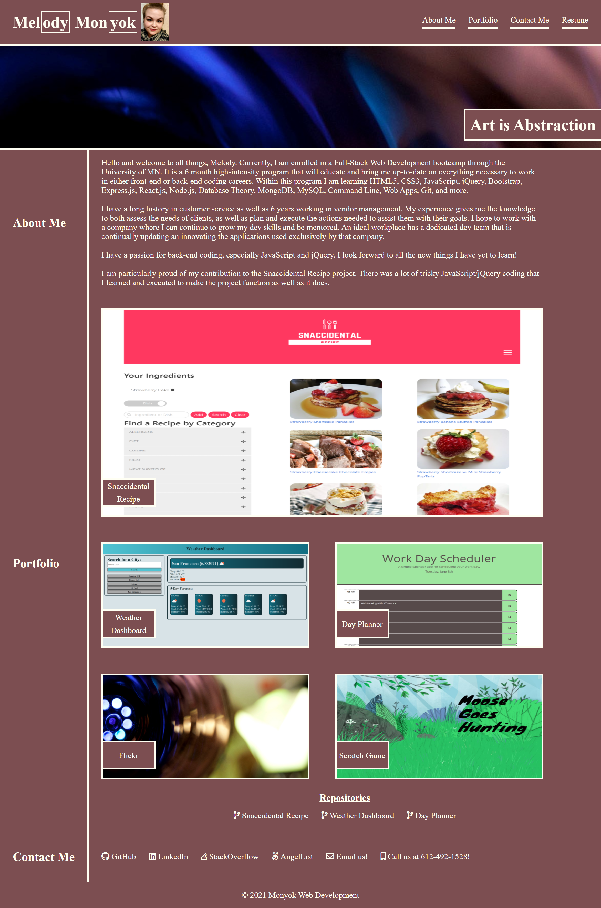

# Portfolio
- A central location to display and easily access all of my projects.

[Live site!](https://github.com/mmonyok/portfolio)

## Project Description
- Having a central location to highlight all of one's career accomplishments in a concise, aesthetically pleasing manner is key to networking and advancing throughout your career.
- I built this portfolio for two reasons. 1) I wanted to give more visual appeal to the array of projects I have completed. 2) It is faster and more simplified to give out my portfolio address, with links to all of my projects and networking sites, then to tell someone to check out my LinkedIn or my GitHub account. It makes me, as a potential employee, more accessible.
- This project helped me to solidy my current knowledge of HTML and CSS, as well as learn how to better troubleshoot issues that came up during more complex html and CSS that I had encountered previously.

## Table of Contents
- [Portfolio](#portfolio)
  - [Project Description](#project-description)
  - [Table of Contents](#table-of-contents)
  - [Installation](#installation)
  - [Usage](#usage)
  - [Credits](#credits)
  - [License](#license)
  - [Badges](#badges)
  - [Contact](#contact)

## Installation
1. Provided that you have a code editor of your choosing installed on your system, such as VS Code (https://code.visualstudio.com/),

2. Provided that you have a Terminal installed for Windows (https://www.microsoft.com/en-us/p/windows-terminal/9n0dx20hk701?rtc=1&activetab=pivot:overviewtab) or are using a Mac with Terminal installed with the OS,

3. You have Git and Github Desktop installed (https://git-scm.com/downloads, https://desktop.github.com/) and have registered for an account,

4. Either Clone or Fork this repository: (https://github.com/mmonyok/portfolio),

5. Create your own repository for the files on GitHub.

6. Edit in your code editor and continue to commit, push changes and perform other Git actions using your repository https://docs.gitlab.com/ee/gitlab-basics/start-using-git.html.

## Usage
Click on any image in the portfolio section to be taken to the deployed site.

## Credits
- Technologies Used:
  - [FontAwesome](https://fontawesome.com/)

- Tutorials Followed:
[Professional README guide template provided by Coding Boot Camp.](https://github.com/coding-boot-camp)

## License
- MIT License

- Copyright (c) [2021] [Melody Monyok]

- Permission is hereby granted, free of charge, to any person obtaining a copy
of this software and associated documentation files (the "Software"), to deal
in the Software without restriction, including without limitation the rights
to use, copy, modify, merge, publish, distribute, sublicense, and/or sell
copies of the Software, and to permit persons to whom the Software is
furnished to do so, subject to the following conditions:

- The above copyright notice and this permission notice shall be included in all
copies or substantial portions of the Software.

- THE SOFTWARE IS PROVIDED "AS IS", WITHOUT WARRANTY OF ANY KIND, EXPRESS OR
IMPLIED, INCLUDING BUT NOT LIMITED TO THE WARRANTIES OF MERCHANTABILITY,
FITNESS FOR A PARTICULAR PURPOSE AND NONINFRINGEMENT. IN NO EVENT SHALL THE
AUTHORS OR COPYRIGHT HOLDERS BE LIABLE FOR ANY CLAIM, DAMAGES OR OTHER
LIABILITY, WHETHER IN AN ACTION OF CONTRACT, TORT OR OTHERWISE, ARISING FROM,
OUT OF OR IN CONNECTION WITH THE SOFTWARE OR THE USE OR OTHER DEALINGS IN THE
SOFTWARE.

## Badges

## Contact
- Melody Monyok
  - <monyokwebdev@gmail.com>
  - (612) 492-1528