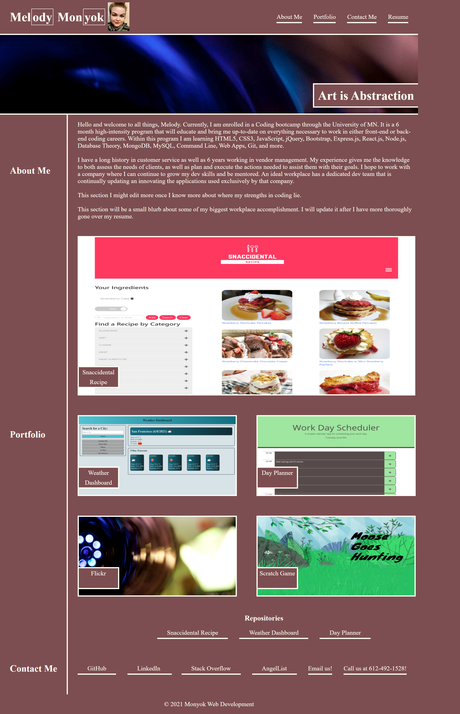

# 02-Week-HW-mmonyok

## Project Description
- Having a central location to highlight all of one's career accomplishments in a concise, aesthetically pleasing manner is key to networking and advancing throughout your career.
- I built this portfolio for two reasons. 1) I wanted to give more visual appeal to the array of projects I have completed, as well as sneak peaks to upcoming projects I am working on. 2) It is faster and more simplified to give out my portfolio address, with links to all of my projects and networking sites, then to tell someone to check out my LinkedIn or my GitHub account. It makes me, as a potential employee, more accessible.
- This project helped me to solidy my current knowledge of HTML and CSS, as well as learn how to better troubleshoot issues that came up during more complex html and CSS that I had encountered previously.
- I think my project takes on the basic requirements of the assignments while instilling my own personal flare to enhance it visually.

## Future Improvements
- Add new projects as they come up.
- Adding Javascript features once I am more knowledgeable.
- Create a brand icon and feature it as the favicon.
- Update Responsive Web Design to accomodate many more screen sizes.

## Credits
- Rhyce Erickson walked me through some of the trickier bits I was struggling with when it came to flex box. Thanks, Rhyce!

## Screenshot

## Deployed Site
[Link to live site.](https://mmonyok.github.io/02-Week-HW-mmonyok/)